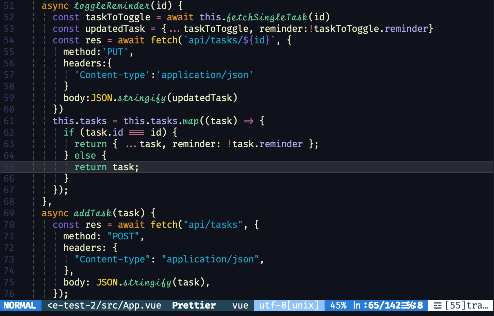
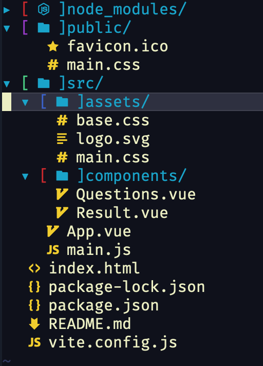

# Fira Code iScript PATCHED with filetype glyphs

A font mashup to be used in code editors, displaying a script typeface for the italic font style.

The Regular and Bold face styles are taken from [Fira Code](https://github.com/tonsky/FiraCode) and [Script12](https://www.myfontsfree.com/134618/script12pitchbt.htm).

Font patched with [Nerd Font Glyphs](https://github.com/ryanoasis/nerd-fonts) using [Font Forge Patcher](https://github.com/ryanoasis/nerd-fonts#font-patcher)

To use with Vim, use [Vim DevIcons Plugin](https://github.com/ryanoasis/vim-devicons)

      
 

 
    

## Install

Download or clone this repository and install the fonts on your system.

In your editor of choice set the font to `Fira Code iScript`.  Also, ensure that the current theme and syntax highlighting utilize italic.
